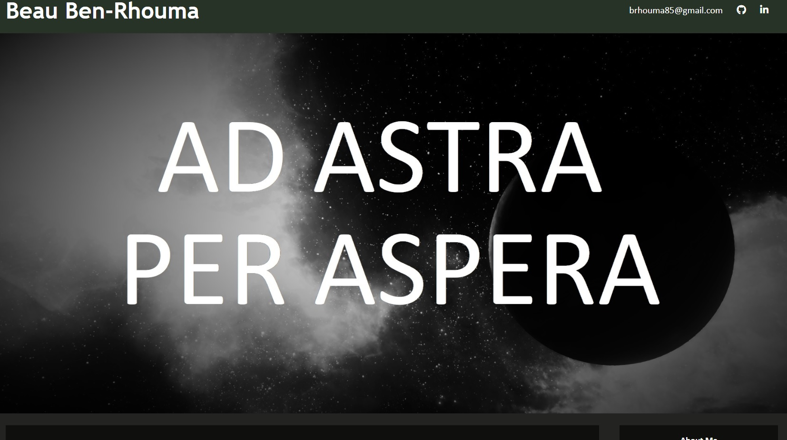
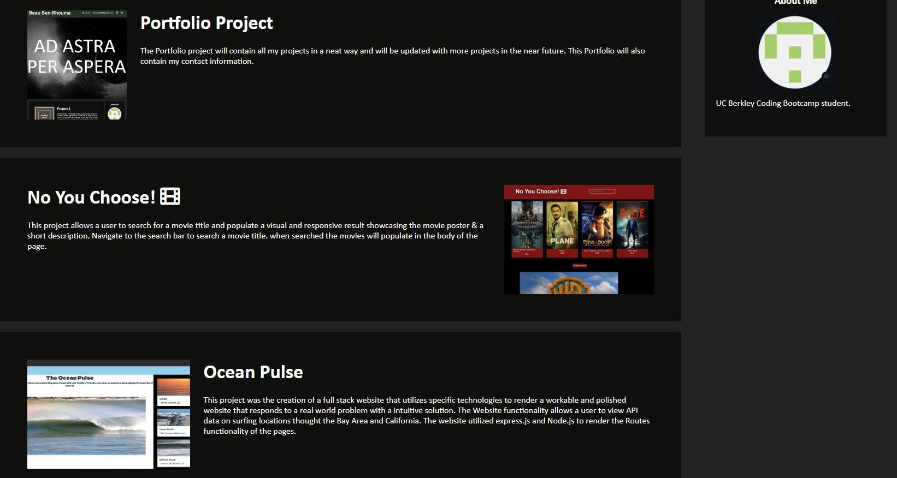

# Portfolio
Module 2 Portfolio Project

## Description
My Portfolio Project is for challenge 2. It is intended as a type of resume to see some of the work I've done for UC Berkeley Coding Boot Camp.

